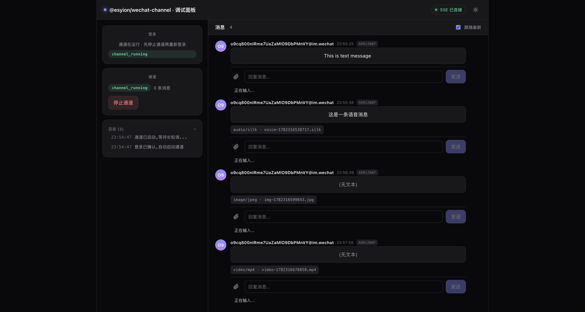

# @esyion/wechat-channel

[](https://www.npmjs.com/package/@esyion/wechat-channel)
[](./LICENSE)
[](https://nodejs.org)

> 基于 WeChat ilink 协议的 Node.js 库。**一行 `onMessage` 回调 = 接入任意 AI**。

## 功能演示

支持 **text / voice / image / video** 四种消息类型的完整收发。下面是真实运行截图：

| 📱 真实微信客户端 | 🖥️ 调试面板 |
| --- | --- |
|  |  |
| *手机端用户视角：文字、语音、图片、视频全部正常显示与播放* | *服务端视角：消息流 + 自动回复 + 状态机 + 运行日志* |

可运行的完整示例见 [`examples/debug-panel/`](./examples/debug-panel/) 与 [`examples/multi-bot/`](./examples/multi-bot/)。

---

## 5 分钟快速集成

### 1. 安装

```bash
npm install @esyion/wechat-channel
```

要求 Node.js ≥ 22。

### 2. 扫码登录拿凭证

```ts
import { loginQR } from "@esyion/wechat-channel";

const qr = await loginQR();  // 无需任何凭证

console.log(qr.toTerminal());  // 终端显示二维码
// 或者 Web 场景: 

const { botToken, accountId } = await qr.waitForLogin();
// ↑ 把这两个值存到 .env 或配置文件里
```

### 3. 开始收发消息

```ts
import { createChannel } from "@esyion/wechat-channel";

const channel = await createChannel({
  botToken: process.env.WECHAT_BOT_TOKEN!,
  accountId: process.env.WECHAT_ACCOUNT_ID!,
  onMessage: async (msg, reply) => {
    // msg.text        — 文本内容
    // msg.fromUserId  — 发送者
    // msg.media       — 已解密的图片/文件/视频

    await reply.text(`你说了: ${msg.text}`);
    await reply.media("/path/to/image.png");
    await reply.typing(true);  // "正在输入…"
  },
});

await channel.start();
```

### 4. 完整示例

[`examples/debug-panel/`](./examples/debug-panel/) 是一个可直接运行的调试面板：

```
Vite + React 前端  ──HTTP/SSE──▶  Express 后端  ──createChannel──▶  WeChat
(登录/消息/回复)                   (状态机/事件广播)                  (ilink 长轮询)
```

```bash
cd examples/debug-panel
pnpm install && pnpm dev:all
# 浏览器打开 http://localhost:5173
```

启动后你就能看到完整的登录→消息→回复流程，**也可以直接把它当作你的 bot 管理面板来用**。

---

## 核心概念

### `createChannel(opts)` → 通道句柄

| 参数 | 默认值 | 说明 |
|---|---|---|
| `botToken` | — | 微信机器人令牌（从 loginQR 获取） |
| `accountId` | — | 微信机器人账号 ID |
| `onMessage` | — | 收到消息的回调 `(msg, reply) => void` |
| `onError` | `console.error` | 错误回调，带 `phase` 区分阶段 |
| `store` | `JsonFileStore` | 会话持久化接口，可换 Redis |
| `baseUrl` | `https://ilinkai.weixin.qq.com` | ilink 网关地址 |
| `cdnBaseUrl` | `https://novac2c.cdn.weixin.qq.com/c2c` | CDN 地址 |
| `stateDir` | `~/.wechat-channel` | 状态文件目录 |
| `longPollTimeoutMs` | `35000` | 长轮询超时 |
| `blockedUsers` | — | 屏蔽的用户 ID 集合 |

### 收到的消息 `msg`

```ts
interface ChannelMsg {
  fromUserId: string;           // 发送者微信 ID
  contextToken: string;         // 会话 token（自动按用户持久化）
  text: string;                 // 文本内容
  media: Array<{                // 已解密到磁盘的媒体文件
    path: string;               //   本地绝对路径
    mime: string;               //   文件类型
  }>;
  raw: WeixinMessage;           // 完整协议结构（高级用法）
}
```

### 回复 `reply`

```ts
await reply.text("你好");                    // 文本（自动处理分块）
await reply.media("/path/photo.png");        // 图片/文件/视频
await reply.media("/path/doc.pdf", "说明");   // 媒体 + 文字说明
await reply.typing(true);                    // 开启"正在输入"心跳
await reply.typing(false);                   // 停止
```

### 登录 `loginQR()`

`loginQR()` 是顶层导出，独立于 `createChannel`，登录阶段无需任何 token。

| 渲染方式 | 适用场景 |
|---|---|
| `qr.toTerminal()` | SSH 终端 / 命令行 |
| `qr.toDataURL()` | Web 页面 `` |
| `qr.toSvg()` | 内联 SVG |
| `qr.toPng()` | 文件写入 / 推送 |
| `qr.matrix` | 自定义渲染 |

### 错误处理

```ts
const channel = await createChannel({
  onError: (err, ctx) => {
    if (ctx?.phase === "sessionExpired") {
      // 微信 session 过期，长轮询会自动暂停 1 小时
    } else if (ctx?.phase === "decrypt") {
      // 媒体解密失败，单条消息跳过，不影响后续
    }
  },
});
```

错误**不会**中断长轮询循环——下一条消息继续正常处理。

### 优雅退出

```ts
const ac = new AbortController();
process.on("SIGINT", () => ac.abort());

await channel.start({ signal: ac.signal });
// SIGINT → 长轮询中止 → 状态落盘 → 通知下线 → exit(0)
```

或者手动 `await channel.stop()`。

---

## 多 Bot 托管

一套服务同时托管多个微信号时用 `createBotManager()`。它是 `createChannel`（单 bot）之上的薄管理层：每个 bot 对应一个平台用户，所有消息走同一个回调，回调首参 `botId` 标识来源，方便你按 bot 做会话隔离。

```ts
import { loginQR, createBotManager } from "@esyion/wechat-channel";

const manager = createBotManager({
  onMessage: async (botId, msg, reply) => {
    // botId 标识是哪个微信号收到的消息，用它做隔离
    console.log(`[${botId}] 收到: ${msg.text}`);
    await reply.text(`收到，你是 ${botId}`);
  },
  onError: (botId, err, ctx) => {
    console.error(`[${botId}] 错误 (${ctx?.phase}):`, err);
  },
});

// 1. 恢复已绑定的 bot（从凭证存储读回，逐个启动）
await manager.startAll();

// 2. 扫码登录拿到凭证后，动态绑定一个新 bot
const qr = await loginQR();
console.log(qr.toTerminal());
const creds = await qr.waitForLogin();   // { botToken, accountId }
await manager.add("bot-a", creds);        // 存盘 + 启动

// 3. 退出时停掉所有 bot
process.on("SIGINT", async () => {
  await manager.stopAll();
  process.exit(0);
});
```

`manager.list()` 查看在线 bot 及状态，`manager.get(botId)` 拿到底层 `ChannelHandle`，`manager.remove(botId, { purge: true })` 停掉并删除凭证。完整可运行示例见 [`examples/multi-bot/`](./examples/multi-bot/)。

> ⚠️ `botToken` 是敏感登录态。默认的 `JsonBotCredentialStore` 将凭证**明文**存盘（`<stateDir>/bots.json`）。生产环境建议传入自定义 `credentialStore` 接入加密存储。

---

## API 参考

### 公开类型

所有类型随包发布，无需额外安装 `@types/...`：

```ts
import {
  createChannel,
  ChannelMsg, Reply,
  QRLoginHandle, LoginResult,
  Store, JsonFileStore, MemoryStore,
  ChannelError, WechatApiError, MediaError,
} from "@esyion/wechat-channel";
```

### 双格式入口

```ts
// ESM
import { createChannel } from "@esyion/wechat-channel";

// CJS
const { createChannel } = require("@esyion/wechat-channel");
```

---

## 发布历史

| 版本 | 说明 |
|---|---|
| v0.2.0 | **破坏性变更**：登录改为顶层 `loginQR()`，不再是 `channel.loginQR()`。登录无需占位 token |
| v0.1.0 | 首次发布。扫码登录、长轮询、媒体加解密、输入状态 |

[MIT](./LICENSE)
